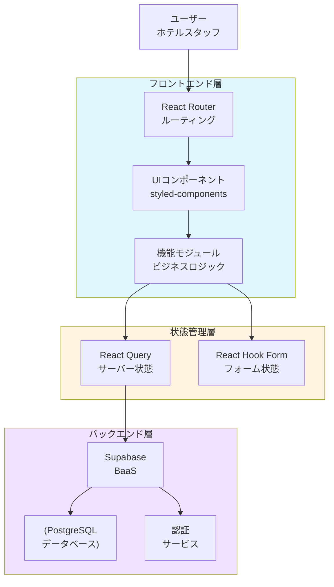
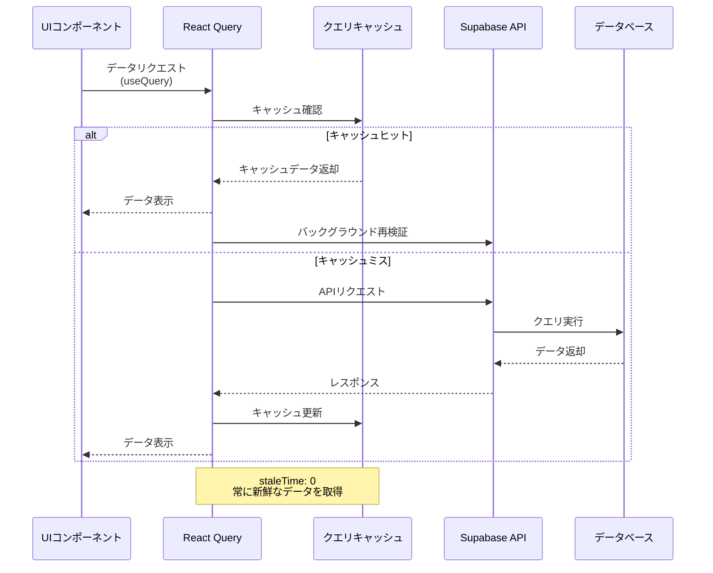

# The Wild Oasis - 概要

## 関連ソースファイル

* __.gitignore__
* __package.json__
* __src/App.tsx__
* __src/features/bookings/BookingDataBox.tsx__
* __src/features/check-in-out/CheckoutButton.tsx__
* __src/features/check-in-out/TodayActivity.tsx__
* __src/features/check-in-out/TodayItem.tsx__
* __src/features/check-in-out/useTodayActivity.ts__
* __src/main.tsx__
* __src/ui/ErrorFallback.tsx__

## 目的と範囲

The Wild Oasisは、ホテルスタッフが客室、予約、ゲスト、および日々の業務を管理するために設計されたReactベースのホテル管理アプリケーションです。この概要では、アプリケーションのアーキテクチャ、コア技術、およびシステム構成について高レベルの理解を提供します。

このドキュメントでは、全体的なシステム構造と主要コンポーネントについて説明します。特定のサブシステムに関する詳細情報については、以下を参照してください:

* 認証フロー: __Authentication System__
* ビジネス機能の実装: __Core Features__
* UIコンポーネントアーキテクチャ: __UI System & Components__
* バックエンド統合パターン: __API Integration__

## アプリケーションアーキテクチャ

The Wild Oasisは、フロントエンドプレゼンテーション、状態管理、バックエンドサービス間で明確な関心の分離を持つモダンなReactシングルページアプリケーションアーキテクチャに従っています。

### 高レベルシステム構造

出典: __src/App.tsx:1-95__ __package.json:16-29__

## コア技術スタック

| 技術 | 目的 | バージョン |
| ------ | ------ | ------------ |
| React | フロントエンドフレームワーク | ^19 |
| TypeScript | 静的型検査 | ^5.9.3 |
| React Router DOM | クライアントサイドルーティング | ^7 |
| @tanstack/react-query | 状態管理とキャッシング | ^5 |
| @supabase/supabase-js | Backend-as-a-Service | ^2.106.2 |
| styled-components | CSS-in-JSスタイリング | ^6.4.2 |
| react-hook-form | フォーム管理 | ^7.77.0 |
| recharts | データ可視化 | ^3 |
| Vite | ビルドツール & 開発サーバー | ^7.3.5 |
| Vitest | ユニットテスト | ^4.1.8 |
| Playwright | E2Eテスト自動化 | ^1.60.0 |

出典: __package.json:16-29__ __package.json:31-49__

## アプリケーションエントリーポイントとルーティング構造

出典: __src/main.tsx:1-17__ __src/App.tsx:30-68__

アプリケーションは、`ProtectedRoute`コンポーネントを通じて認証を必要とする保護されたルーティング戦略を実装しており、ログインページのみが未認証ユーザーにアクセス可能です。ルートルート(`/`)は自動的に`/dashboard`にリダイレクトされます。

## 状態管理とデータフロー

アプリケーションは、React Query(`@tanstack/react-query`)を主要な状態管理ソリューションとして使用し、サーバー状態の同期、キャッシング、バックグラウンド更新を提供します。データフローは以下のパターンに従います:

出典: __src/App.tsx:21-28__ __package.json:16-17__

React Queryクライアントは`staleTime`を0に設定しており、常に新鮮なデータを取得し、クエリ状態のデバッグ用の開発ツールを含んでいます。

## コア機能エリア

アプリケーションは5つの主要なビジネスドメインを中心に構成されています:

| 機能 | ルート | 目的 |
| ------ | -------- | ------ |
| ダッシュボード | `/dashboard` | 分析と今日のアクティビティ概要 |
| 客室管理 | `/cabins` | ホテル客室のCRUD操作 |
| 予約管理 | `/bookings`, `/bookings/:id` | 予約ライフサイクル管理 |
| チェックイン/チェックアウト | `/checkin/:bookingId` | ゲストの到着と出発プロセス |
| ユーザー管理 | `/users` | スタッフアカウント管理 |
| 設定 | `/settings` | アプリケーション設定 |
| アカウント | `/account` | 現在のユーザープロフィール管理 |

出典: __src/App.tsx:46-63__

## エラーハンドリングと開発ツール

アプリケーションは、React Error Boundaryを通じた包括的なエラーハンドリングを実装し、デバッグ用の開発ツールを提供します:

* __Error Boundary__: `ErrorFallback`コンポーネントを介してユーザーフレンドリーなエラーメッセージをキャッチして表示
* __React Query DevTools__: キャッシュ状態とクエリパフォーマンスを検査するために開発環境で利用可能
* __Hot Toast通知__: `react-hot-toast`を介したアクションとエラーのユーザーフィードバック
* __グローバルスタイル__: styled-componentsを通じた一貫したテーマ設定

出典: __src/main.tsx:9-14__ __src/App.tsx:34-89__ __src/ui/ErrorFallback.tsx:36-51__

エラーバウンダリは、ユーザーがエラーに遭遇したときに自動的にホームページにリセットし、優雅な回復メカニズムを提供します。

## AI開発環境

このプロジェクトはAI仕様駆動開発（SDD）に対応しています。

### 設定ファイル

| ファイル / ディレクトリ | 対象ツール | 用途 |
| ------------------------ | ----------- | ------ |
| `CLAUDE.md` | Claude Code | プロジェクト永続メモリ |
| `.claude/steering/` | Claude Code | チーム横断コンテキスト（プロダクト / 技術） |
| `.claude/agents/` | Claude Code | サブエージェント定義（レビュー / テスト） |
| `GEMINI.md` | Antigravity | グローバル永続メモリ |
| `.agent/rules/` | Antigravity | プロジェクトルール（常時 / ファイルマッチ） |
| `.agent/workflows/` | Antigravity | ワークフロー（`/review`, `/deploy`） |

### 仕様書

| ファイル | 用途 |
| --------- | ------ |
| `docs/spec.md` | プロダクト仕様書 |
| `docs/design.md` | 技術設計書 |
| `docs/tasks.md` | タスク追跡 |
