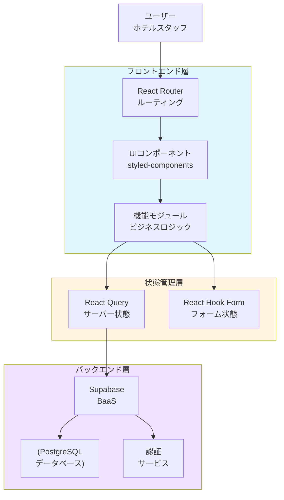
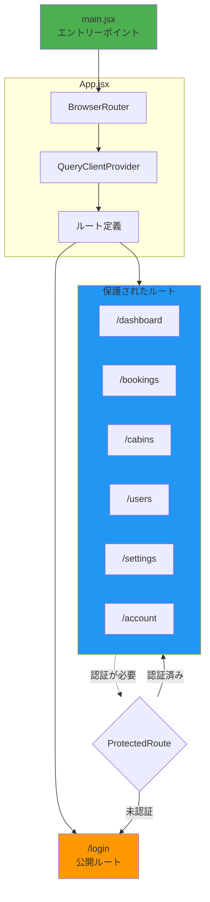
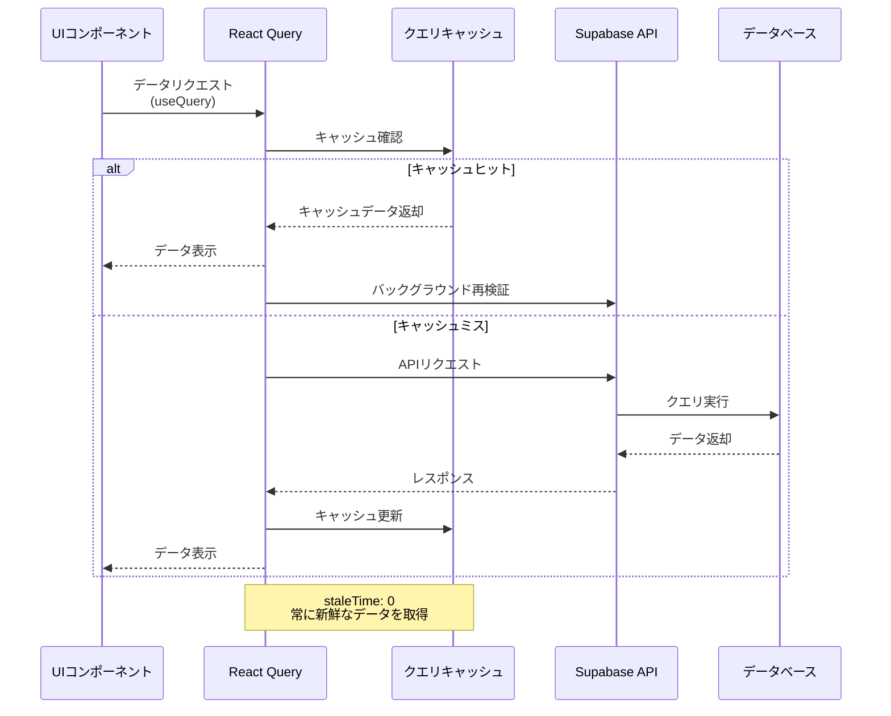

# The Wild Oasis - 概要

## 関連ソースファイル
* __.gitignore__
* __package-lock.json__
* __package.json__
* __src/App.jsx__
* __src/features/bookings/BookingDataBox.jsx__
* __src/features/check-in-out/CheckoutButton.jsx__
* __src/features/check-in-out/TodayActivity.jsx__
* __src/features/check-in-out/TodayItem.jsx__
* __src/features/check-in-out/useTodayActivity.js__
* __src/main.jsx__
* __src/ui/ErrorFallback.jsx__

## 目的と範囲

The Wild Oasisは、ホテルスタッフが客室、予約、ゲスト、および日々の業務を管理するために設計されたReactベースのホテル管理アプリケーションです。この概要では、アプリケーションのアーキテクチャ、コア技術、およびシステム構成について高レベルの理解を提供します。

このドキュメントでは、全体的なシステム構造と主要コンポーネントについて説明します。特定のサブシステムに関する詳細情報については、以下を参照してください:

* 認証フロー: __Authentication System__
* ビジネス機能の実装: __Core Features__
* UIコンポーネントアーキテクチャ: __UI System & Components__
* バックエンド統合パターン: __API Integration__

## アプリケーションアーキテクチャ

The Wild Oasisは、フロントエンドプレゼンテーション、状態管理、バックエンドサービス間で明確な関心の分離を持つモダンなReactシングルページアプリケーションアーキテクチャに従っています。

### 高レベルシステム構造

出典: __src/App.jsx1-95__ __package.json12-25__

## コア技術スタック

| 技術 | 目的 | バージョン |
|------|------|------------|
| React | フロントエンドフレームワーク | ^18.2.0 |
| React Router DOM | クライアントサイドルーティング | ^6.25.1 |
| @tanstack/react-query | 状態管理とキャッシング | ^4.36.1 |
| @supabase/supabase-js | Backend-as-a-Service | ^2.44.4 |
| styled-components | CSS-in-JSスタイリング | ^6.1.12 |
| react-hook-form | フォーム管理 | ^7.52.1 |
| recharts | データ可視化 | ^2.12.7 |
| Vite | ビルドツール & 開発サーバー | ^4.5.5 |

出典: __package.json12-25__ __package.json27-39__

## アプリケーションエントリーポイントとルーティング構造

出典: __src/main.jsx1-17__ __src/App.jsx30-68__

アプリケーションは、`ProtectedRoute`コンポーネントを通じて認証を必要とする保護されたルーティング戦略を実装しており、ログインページのみが未認証ユーザーにアクセス可能です。ルートルート(`/`)は自動的に`/dashboard`にリダイレクトされます。

## 状態管理とデータフロー

アプリケーションは、React Query(`@tanstack/react-query`)を主要な状態管理ソリューションとして使用し、サーバー状態の同期、キャッシング、バックグラウンド更新を提供します。データフローは以下のパターンに従います:

出典: __src/App.jsx21-28__ __package.json13-14__

React Queryクライアントは`staleTime`を0に設定しており、常に新鮮なデータを取得し、クエリ状態のデバッグ用の開発ツールを含んでいます。

## コア機能エリア

アプリケーションは5つの主要なビジネスドメインを中心に構成されています:

| 機能 | ルート | 目的 |
|------|--------|------|
| ダッシュボード | `/dashboard` | 分析と今日のアクティビティ概要 |
| 客室管理 | `/cabins` | ホテル客室のCRUD操作 |
| 予約管理 | `/bookings`, `/bookings/:id` | 予約ライフサイクル管理 |
| チェックイン/チェックアウト | `/checkin/:bookingId` | ゲストの到着と出発プロセス |
| ユーザー管理 | `/users` | スタッフアカウント管理 |
| 設定 | `/settings` | アプリケーション設定 |
| アカウント | `/account` | 現在のユーザープロフィール管理 |

出典: __src/App.jsx46-63__

## エラーハンドリングと開発ツール

アプリケーションは、React Error Boundaryを通じた包括的なエラーハンドリングを実装し、デバッグ用の開発ツールを提供します:

* **Error Boundary**: `ErrorFallback`コンポーネントを介してユーザーフレンドリーなエラーメッセージをキャッチして表示
* **React Query DevTools**: キャッシュ状態とクエリパフォーマンスを検査するために開発環境で利用可能
* **Hot Toast通知**: `react-hot-toast`を介したアクションとエラーのユーザーフィードバック
* **グローバルスタイル**: styled-componentsを通じた一貫したテーマ設定

出典: __src/main.jsx9-14__ __src/App.jsx34-89__ __src/ui/ErrorFallback.jsx36-51__

エラーバウンダリは、ユーザーがエラーに遭遇したときに自動的にホームページにリセットし、優雅な回復メカニズムを提供します。
