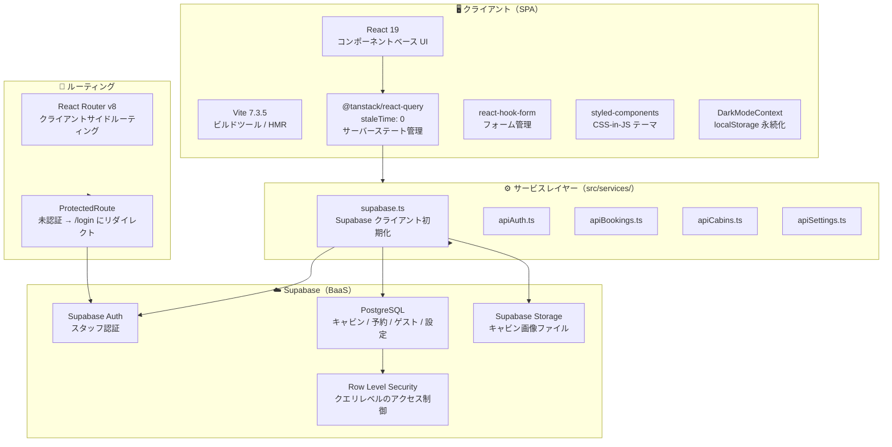
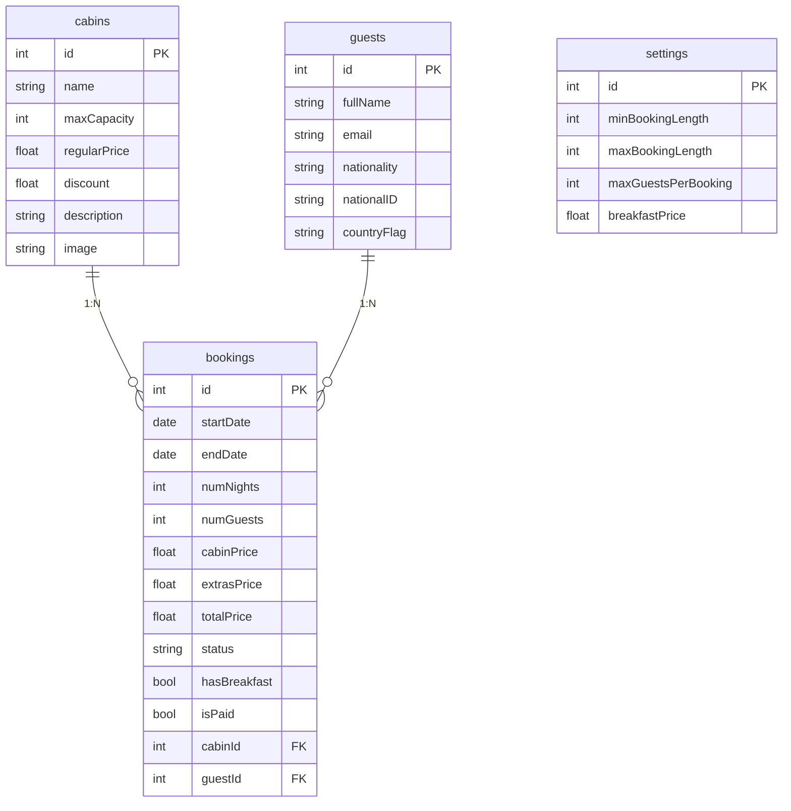
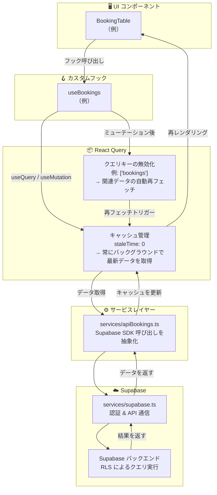
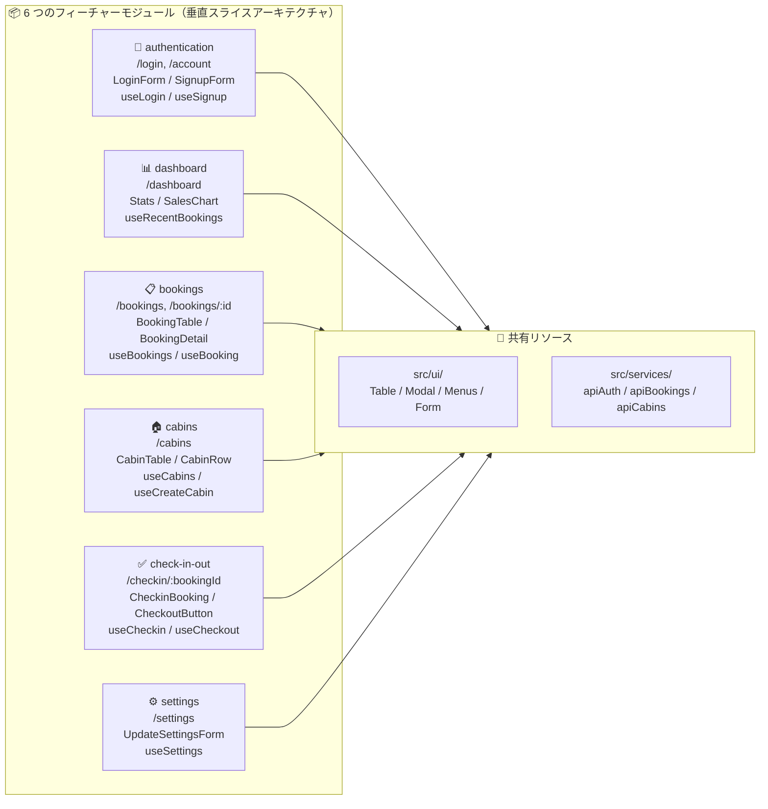
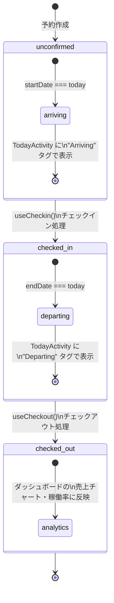
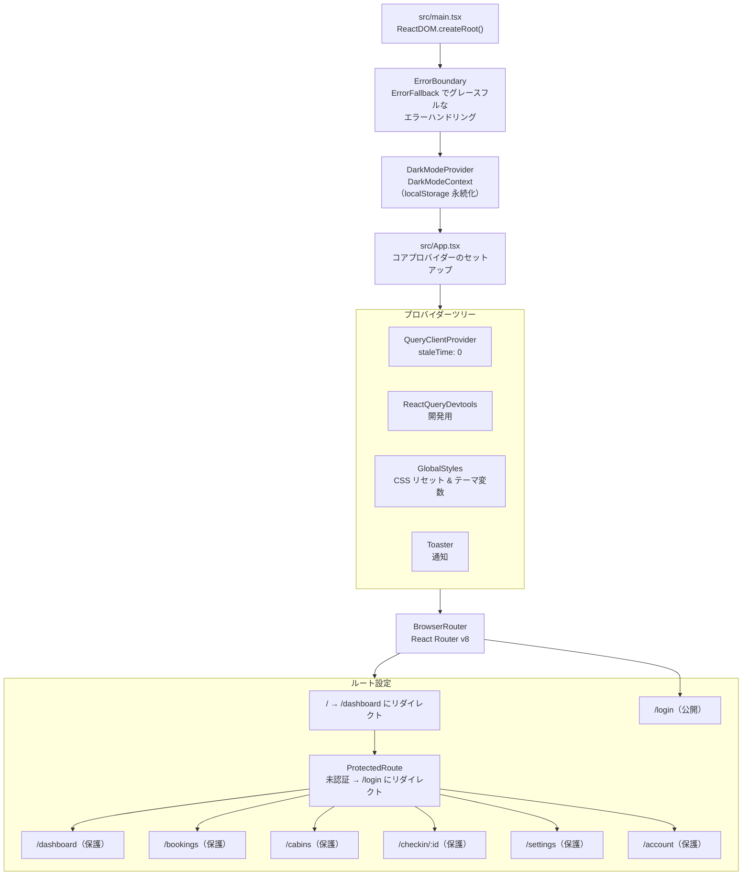
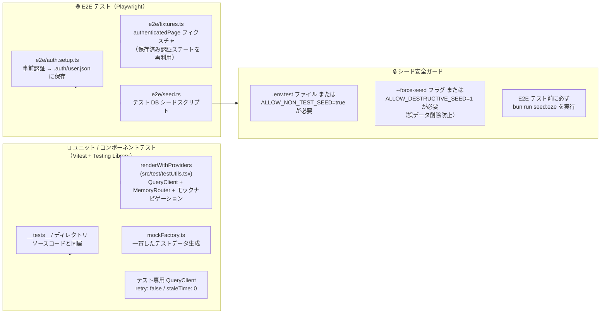

# 概要

**関連ソースファイル**: `README.md` / `docs/spec.md` / `docs/design.md` / `src/main.tsx` / `src/App.tsx` / `package.json`

The Wild Oasis は、ホテルスタッフが**キャビン（客室）・予約・ゲスト・日常業務**を管理するための React ベースのホテル管理アプリケーションです。ゲスト向けインターフェースは一切なく、**内部スタッフ専用のダッシュボードアプリ**として設計されています。

各サブシステムの詳細については以下を参照してください。

- 完全なアーキテクチャ詳細 → [Architecture](#システムアーキテクチャの概要)
- 技術スタックとプロジェクト構造 → [Architecture](#システムアーキテクチャの概要) / [Project Structure](#プロジェクトのディレクトリ構成)
- ドメインエンティティと関係 → [Domain Model](#ドメインモデル)
- データレイヤーパターン → [Data Layer](#データフローアーキテクチャ)
- 各フィーチャーの実装 → [Features](#フィーチャーモジュール)
- UI コンポーネントライブラリ → [UI Component Library](#プロジェクトのディレクトリ構成)
- テストインフラ → [Testing](#開発テストインフラ)
- 開発セットアップとワークフロー → [Development Guide](#開発テストインフラ)

---

## システムアーキテクチャの概要



このアプリケーションは、**React 19 によるクライアントサイドレンダリングの SPA アーキテクチャ**を採用しています。フロントエンドは Vite で構築され、
認証・データベース操作・ファイルストレージのために Supabase（Backend-as-a-Service）と通信します。React Query は積極的なキャッシュ無効化戦略（`staleTime: 0`）でプライマリな状態管理ソリューションとして機能します。

---

## 技術スタック

| レイヤー | 技術 | バージョン | 用途 |
|---------|------|-----------|------|
| **言語** | TypeScript | ^5.9.3 | 静的型チェック（strict モード） |
| **UI フレームワーク** | React | >=19.2.7 | コンポーネントベース UI レンダリング |
| **ビルドツール** | Vite | ^7.3.5 | 高速開発サーバーと最適化ビルド |
| **パッケージマネージャー** | Bun | >=1.0.0 | パッケージ管理とスクリプト実行 |
| **ルーティング** | React Router | ^8.3.0 | 保護ルート付きクライアントサイドルーティング |
| **状態管理** | @tanstack/react-query | ^5 | サーバーステートの同期とキャッシュ |
| **フォーム管理** | react-hook-form | ^7.77.0 | パフォーマンスの高いフォームバリデーション |
| **スタイリング** | styled-components | ^6.4.2 | テーマサポート付き CSS-in-JS |
| **バックエンド** | Supabase | ^2.106.2 | 認証・PostgreSQL・ストレージ |
| **チャート** | recharts | ^3 | ダッシュボードのデータ可視化 |
| **日付ユーティリティ** | date-fns | ^4 | 日付フォーマットと操作 |
| **通知** | react-hot-toast | ^2.6.0 | ユーザーフィードバックメッセージ |
| **エラーハンドリング** | react-error-boundary | ^6 | エラーバウンダリコンポーネント |
| **ユニットテスト** | Vitest | ^4.1.8 | ユニット / コンポーネントテストランナー |
| **コンポーネントテスト** | @testing-library/react | ^16.3.2 | コンポーネントテストユーティリティ |
| **E2E テスト** | Playwright | ^1.60.0 | エンドツーエンドブラウザ自動化 |

---

## ドメインモデル



Supabase PostgreSQL に格納された **4 つの主要エンティティ**で構成されます。

- **`cabins`（キャビン）**: 予約可能なホテル客室。定員・料金・割引・説明・画像を持つ
- **`guests`（ゲスト）**: 国籍・身分証明書を含む顧客情報
- **`bookings`（予約）**: キャビンとゲストをつなぐ中心エンティティ。ライフサイクルステータス（`unconfirmed` → `checked-in` → `checked-out`）・日付・料金計算・朝食オプションを追跡
- **`settings`（設定）**: アプリ全体のビジネスルールを格納するシングルトンテーブル（常に `id=1`）
- **`users`（ユーザー）**: Supabase Authentication で管理されるスタッフアカウント（PostgreSQL テーブルには直接存在しない）

---

## データフローアーキテクチャ



データは **6 層のアーキテクチャ**を流れます。

1. **UI コンポーネント**（例: `BookingTable`）がカスタムフックを呼び出す
2. **カスタムフック**（例: `useBookings`）が React Query の操作をラップする
3. **React Query** が `staleTime: 0` でキャッシュを管理し、常にバックグラウンドで最新データを取得
4. **サービスレイヤー**（`services/apiBookings.ts`）が Supabase SDK 呼び出しを抽象化
5. **Supabase クライアント**（`services/supabase.ts`）が認証と API 通信を処理
6. **Supabase バックエンド**が Row Level Security（RLS）を適用してクエリを実行

ミューテーション後、React Query は関連するクエリキー（例: `['bookings']`）を無効化し、影響を受けるデータの自動再フェッチをトリガーします。

---

## フィーチャーモジュール



アプリケーションは**垂直スライスアーキテクチャ**に従った 6 つのフィーチャーモジュールで構成されています。

| フィーチャー | ルート | コンポーネント | カスタムフック | 用途 |
|------------|-------|-------------|-------------|------|
| **authentication** | `/login`, `/account` | `LoginForm`, `SignupForm`, `UserAvatar` | `useLogin`, `useSignup`, `useUser`, `useLogout` | スタッフ認証とアカウント管理 |
| **dashboard** | `/dashboard` | `DashboardLayout`, `Stats`, `SalesChart`, `DurationChart`, `TodayActivity` | `useRecentBookings`, `useRecentStays`, `useTodayActivity` | 分析・チャート・本日のアクティビティ |
| **bookings** | `/bookings`, `/bookings/:id` | `BookingTable`, `BookingRow`, `BookingDetail`, `BookingDataBox` | `useBookings`, `useBooking`, `useDeleteBooking` | 予約ライフサイクル管理とフィルタリング |
| **cabins** | `/cabins` | `CabinTable`, `CabinRow`, `CreateCabinForm` | `useCabins`, `useCreateCabin`, `useEditCabin`, `useDeleteCabin` | キャビン CRUD 操作と画像アップロード |
| **check-in-out** | `/checkin/:bookingId` | `CheckinBooking`, `CheckoutButton`, `TodayItem` | `useCheckin`, `useCheckout` | 朝食オプション付きチェックイン / チェックアウト処理 |
| **settings** | `/settings` | `UpdateSettingsForm` | `useSettings`, `useUpdateSetting` | アプリ全体の設定管理 |

---

## 予約ライフサイクルのステートマシン



`bookings.status` に格納された **3 つのステート**で予約ライフサイクルを管理します。

1. **`"unconfirmed"`（未確認）**: 予約作成時の初期ステート。`startDate === today` の場合、`TodayActivity` に "Arriving" タグで表示。`/checkin/:bookingId` ルートの `CheckinBooking` コンポーネントでチェックイン可能。

2. **`"checked-in"`（チェックイン済み）**: 滞在中のアクティブステート。`endDate === today` の場合、`TodayActivity` に "Departing" タグで表示。`CheckoutButton` コンポーネントから `useCheckout` フックを呼び出してチェックアウト可能。

3. **`"checked-out"`（チェックアウト済み）**: 滞在完了ステート。ダッシュボードの売上チャートや稼働率などの履歴分析に含まれる。

**ステート遷移の実装**:
- `useCheckin`（`src/features/check-in-out/useCheckin.ts`）→ `"checked-in"` に更新
- `useCheckout`（`src/features/check-in-out/useCheckout.ts`）→ `"checked-out"` に更新

---

## アプリケーションエントリーポイントとルーティング



初期化シーケンス:

1. **`src/main.tsx`**: `ReactDOM.createRoot()` を使用して React アプリを DOM にマウント
2. **ErrorBoundary**: `ErrorFallback` コンポーネントを使ってアプリ全体を `<ErrorBoundary>` でラップ
3. **DarkModeProvider**: localStorage 永続化付きの `DarkModeContext` からテーマコンテキストを提供
4. **`src/App.tsx`**: コアプロバイダーのセットアップ:
   - `staleTime: 0` 設定の `QueryClientProvider`
   - 開発用 `ReactQueryDevtools`
   - CSS リセットとテーマ変数用の `GlobalStyles`
   - 通知用の `Toaster`
5. **BrowserRouter**: React Router v8 でクライアントサイドルーティングを設定

保護ルートは `ProtectedRoute` コンポーネントによる認証が必要で、未認証ユーザーは `/login` にリダイレクトされます。ルートルート `/` は `/dashboard` にリダイレクトします。

---

## 開発・テストインフラ

### 開発スクリプト

`bun` をパッケージマネージャーとして使用します（`package.json` の `engines` で必須）。
React Router v8 の互換要件として、Node.js で依存監査や補助ツールを実行する場合は
Node.js 22.22.0 以上、React 19.2.7 以上、Vite 7 以上を使用します。

| コマンド | スクリプト | 用途 |
|---------|-----------|------|
| `bun run dev` | `vite` | HMR 付き開発サーバーを起動 |
| `bun run build` | `vite build` | `dist/` にプロダクションビルド |
| `bun run lint` | `eslint . --ext js,jsx,ts,tsx` | ESLint コード品質チェック |
| `bun run typecheck` | `tsc --noEmit` | TypeScript 型検証 |
| `bun run test` | `vitest run` | Vitest ユニット / コンポーネントテストを実行 |
| `bun run test:watch` | `vitest` | ユニットテストのウォッチモード |
| `bun run seed:e2e` | `bun run e2e/seed.ts --force-seed` | E2E テストデータベースをシード |
| `bun run test:e2e` | `bun run seed:e2e && bunx playwright test` | E2E テストスイートを実行 |

### テスト戦略



---

## プロジェクトのディレクトリ構成

```
the-wild-oasis/
├── src/
│   ├── main.tsx                    # アプリケーションエントリーポイント
│   ├── App.tsx                     # Router + QueryClientProvider + GlobalStyles
│   ├── context/
│   │   └── DarkModeContext.tsx     # テーマ状態管理
│   ├── features/                   # フィーチャーモジュール（垂直スライス）
│   │   ├── authentication/
│   │   ├── bookings/
│   │   ├── cabins/
│   │   ├── check-in-out/
│   │   ├── dashboard/
│   │   └── settings/
│   ├── hooks/                      # 共有カスタムフック
│   │   ├── useOutsideClick.ts
│   │   └── useLocalStorageState.ts
│   ├── pages/                      # ページコンポーネント（ルートターゲット）
│   ├── services/                   # API 抽象化レイヤー
│   │   ├── supabase.ts             # Supabase クライアント初期化
│   │   ├── apiAuth.ts
│   │   ├── apiBookings.ts
│   │   ├── apiCabins.ts
│   │   └── apiSettings.ts
│   ├── styles/
│   │   └── GlobalStyles.ts         # グローバル CSS とテーマ変数
│   ├── test/
│   │   ├── setup.ts                # Vitest ポリフィルと設定
│   │   ├── testUtils.tsx           # テストレンダリングユーティリティ
│   │   └── mockFactory.ts          # テストデータジェネレーター
│   ├── types/
│   │   ├── domain.ts               # ドメインエンティティ型（Cabin, Booking など）
│   │   ├── supabase.ts             # Supabase 生成型
│   │   └── common.ts               # 共有ユーティリティ型
│   ├── ui/                         # 再利用可能な UI コンポーネント
│   │   ├── Table.tsx               # 複合コンポーネントパターン
│   │   ├── Modal.tsx               # ポータルベースのモーダル
│   │   ├── Menus.tsx               # コンテキストメニューシステム
│   │   ├── Form.tsx                # フォームプリミティブ
│   │   └── ...                     # Button, Input, Heading など
│   └── utils/
│       ├── helpers.ts              # ユーティリティ関数
│       └── constants.ts            # アプリケーション定数
├── e2e/
│   ├── seed.ts                     # E2E データベースシードスクリプト
│   ├── auth.setup.ts               # 事前認証セットアップ
│   ├── fixtures.ts                 # Playwright フィクスチャ
│   └── *.spec.ts                   # E2E テスト仕様
├── docs/
│   ├── spec.md                     # プロダクト仕様
│   ├── design.md                   # 技術設計ドキュメント
│   └── tasks.md                    # 実装タスクトラッキング
├── .agent/                         # Antigravity / Gemini AI 設定
│   ├── rules/                      # プロジェクトルール（always, fileMatch）
│   └── workflows/                  # AI ワークフロー（/review, /deploy）
├── .claude/                        # Claude Code 設定
│   ├── agents/                     # サブエージェント定義
│   └── steering/                   # コンテキストドキュメント
├── package.json                    # 依存関係とスクリプト
├── tsconfig.json                   # TypeScript 設定（strict）
├── vite.config.ts                  # Vite ビルド設定
├── vitest.config.ts                # Vitest テスト設定
├── playwright.config.ts            # Playwright E2E 設定
├── .env.example                    # 環境変数テンプレート
└── README.md                       # プロジェクトドキュメント
```

**主な構成原則**:

1. **フィーチャーベースの構造**: 各フィーチャーモジュール（`src/features/*`）がそのドメインのコンポーネント・フック・テストをすべて含む
2. **共有インフラ**: `src/ui/`・`src/hooks/`・`src/utils/` にフィーチャー横断で使用される再利用可能なコードを配置
3. **サービスレイヤー抽象化**: `src/services/` が Supabase API 呼び出しをビジネスロジックから分離
4. **型安全性**: `src/types/` がドメインモデルと API コントラクトを定義
5. **コロケーション**: テストファイルをソースコードに隣接する `__tests__/` ディレクトリに配置
