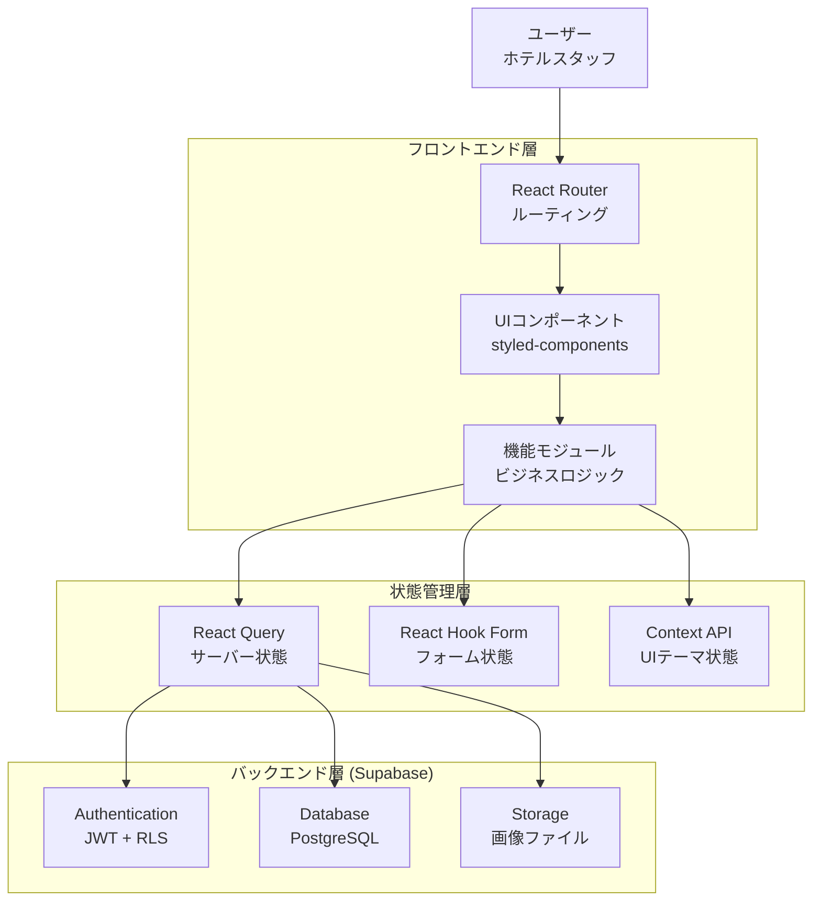
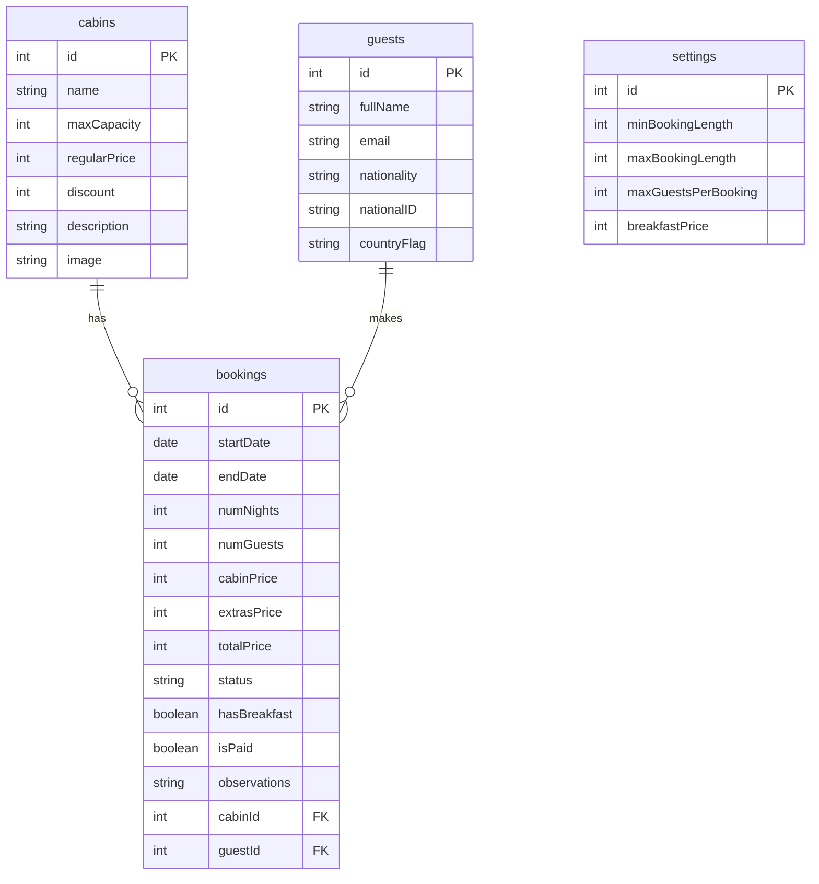
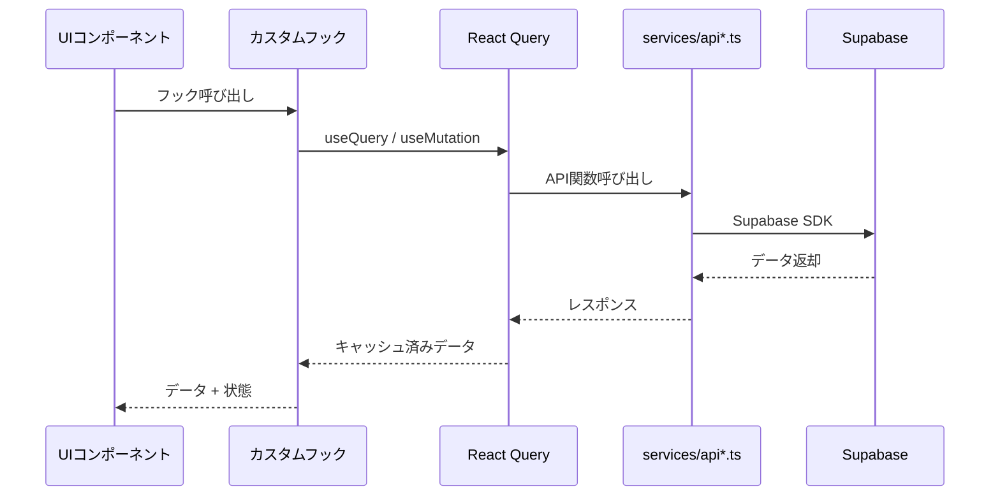

# 技術設計書

## アーキテクチャ概要

React SPA + Supabase BaaS 構成。フロントエンドで完結する Client-Side Rendering アーキテクチャ。



## ディレクトリ構造

```text
src/
├── main.tsx                  # エントリーポイント
├── App.tsx                   # ルート定義 + プロバイダー
├── context/
│   ├── DarkModeContext.tsx   # ダークモードテーマ管理
│   └── __tests__/            # コンテキストテスト
├── features/
│   ├── authentication/       # ログイン / ログアウト / アカウント管理
│   ├── bookings/             # 予約一覧 / 詳細 / 操作
│   ├── cabins/               # 客室 CRUD
│   ├── check-in-out/         # チェックイン / チェックアウト処理
│   ├── dashboard/            # 統計 / チャート / 今日のアクティビティ
│   └── settings/             # アプリ設定管理
├── hooks/
│   ├── useOutsideClick.ts    # 汎用フック
│   └── __tests__/            # フックテスト
├── pages/                    # ルートに対応するページコンポーネント
├── services/
│   ├── supabase.ts           # Supabase クライアント初期化
│   ├── apiAuth.ts            # 認証 API
│   ├── apiBookings.ts        # 予約 API
│   ├── apiCabins.ts          # 客室 API
│   ├── apiSettings.ts        # 設定 API
│   └── __tests__/            # サービステスト
├── styles/
│   └── GlobalStyles.ts       # グローバルスタイル定義
├── test/
│   └── setup.ts              # Vitest セットアップ
├── types/
│   ├── domain.ts             # ドメイン型定義（Cabin, Booking 等）
│   ├── supabase.ts           # Supabase 型定義
│   └── common.ts             # 共通ユーティリティ型
├── ui/                       # 再利用可能 UI コンポーネント（.tsx）
└── utils/
    ├── helpers.ts            # ユーティリティ関数
    ├── constants.ts          # 定数定義
    └── __tests__/            # ユーティリティテスト
```

## データモデル（Supabase テーブル）



## データフローパターン



## 技術スタック

| レイヤー | 技術 | 選定理由 |
| ------- | ------ | --------- |
| Language | TypeScript 5.9 (strict) | 型安全性、リファクタリング支援 |
| UI | React 18 | コンポーネント指向、Hooks対応 |
| Routing | React Router v6 | 宣言的ルーティング、ネストルート |
| State | React Query v4 | サーバー状態同期、楽観的更新 |
| Styling | styled-components v6 | CSS-in-JS、テーマ対応 |
| Forms | react-hook-form v7 | 高パフォーマンスフォーム管理 |
| BaaS | Supabase | PostgreSQL + Auth + Storage 統合 |
| Build | Vite 7 | 高速 HMR、ES Modules ネイティブ |
| Testing | Vitest 4 + Testing Library | ユニット・コンポーネントテスト |
| Deploy | Vercel | Vite 最適化、自動プレビュー |

## テスト戦略

### テスト構成

各モジュールの `__tests__/` ディレクトリにテストファイルを配置。

| 対象 | テストファイル | カバレッジ |
| ---- | ------------- | --------- |
| 型定義 | `types/__tests__/domain.test.ts` | ドメイン型の型テスト |
| ユーティリティ | `utils/__tests__/helpers.test.ts`, `constants.test.ts` | 関数・定数の単体テスト |
| カスタムフック | `hooks/__tests__/useLocalStorageState.test.ts`, `useOutsideClick.test.ts` | フック動作テスト |
| コンテキスト | `context/__tests__/DarkModeContext.test.tsx` | コンテキスト + プロバイダーテスト |
| サービス | `services/__tests__/services.test.ts` | API 関数テスト |

### テスト実行

```bash
bun run test           # 全テスト実行
bun run test:watch     # ウォッチモード
bun run test:coverage  # カバレッジレポート付き実行
```
